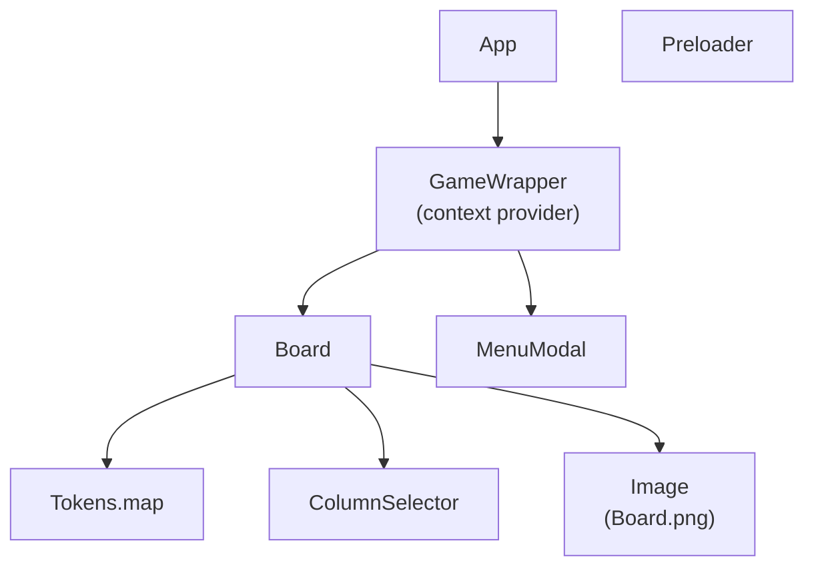

# Connect-four

Connect four game made with react, vite, node and typescript

Ce document fournit un aperçu d'une application React TypeScript et Node.js. L'application utilise le framework React avec TypeScript pour construire des interfaces utilisateur, et Node.js pour le serveur backend.

## Arbre de composants React

Le diagramme suivant représente une simplification de l'arbre des composants de l'application React :



## Wrapper et Context API

Le composant `GameWrapper` agit comme un conteneur autour des principaux composants de l'application et utilise l'API Context pour gérer l'état global.
Il fournit le contexte nécessaire à ses composants enfants, leur permettant d'accéder et de modifier l'état partagé.

# Fonctionnement

L'application utilise des `WebSockets` pour la communication en temps réel entre le client et le serveur.
Les WebSockets permettent des canaux de communication bidirectionnels en duplex intégral sur une seule connexion TCP, ce qui permet au serveur de pousser
des mises à jour vers le client en temps réel.

Ainsi, lorsque un joueur joue une piece ou rejoint une partie, l'autre joueur est notifié en temps réel.
Le composant `GameWrapper` met automatiquement à jour l'etat de l'application en fonction des messages WebSocket recus.

Backend Node.js

Le serveur backend Node.js gère diverses tâches, notamment la fourniture de l'application React, la gestion des requêtes API et la gestion des connexions WebSocket. Il fournit des points d'accès pour récupérer et mettre à jour les données, ainsi que pour gérer les événements WebSocket.
L'objectif de cet exercice étant de se concentrer sur l'application React, le backend Node.js est très simple et ne contient pas de base de données.

## Lancer l'application en local

Pour lancer l'application en local, il faut d'abord installer les dépendances du projet ( a faire dans les dossiers `Frontend` et `Backend` ) :
```bash
pnpm install
```

Ensuite, il faut lancer le serveur backend Node.js :
```bash
pnpm run
```
